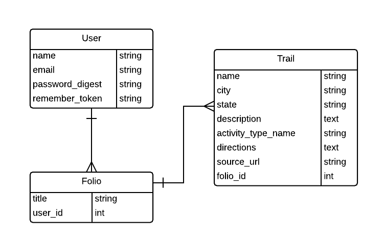

#TRAILFOLIO
     

##General Assembly WDI Project 1, October 2014
 

##Overview

TrailFolio is a web application that allows users to create 'Folios' for the purpose of organizing trails they like, would like to visit, have visited, etc. Users search through thousands of trails as well as campgrounds, and ski resorts based on location, activity type using [trailAPI](http://www.trailapi.com/). Sign up for full functionality!

TrailFolio was developed for a project for the Fall 2014 Web Development Immersive course at General Assembly in Atlanta, GA. It was developed over a week-long sprint to model the agile software development process.

##Technologies Used
* Ruby 2.1.2
* Rails 4.1.6
* [Bootstrap 3.2.0](http://getbootstrap.com/)
* PostgreSQL Database
* Authentication & Authorization from scratch using [b-crypt-ruby](http://bcrypt-ruby.rubyforge.org/ "bcrypt-ruby")
* [trailAPI](http://www.trailapi.com/) & [HTTParty](https://github.com/jnunemaker/httparty)
* Testing using [rspec-rails](https://github.com/rspec/rspec-rails), [capybara](https://github.com/jnicklas/capybara), and [factory_girl_rails](https://github.com/thoughtbot/factory_girl_rails)

##User Stories
* As a user, I can sign up for an account with a name, email address, and password
* As a user, I can sign in and sign out of my account
* As an authenticated user, I can create new folios, search for trails, and view my folios from my profile page
* As an authenticated user, I can search for trails by activity (dropdown), and/or location 
* As an authenticated user, I can view a list of search results and link to a specific search result 
* As an authenticated user, I can save a specific search result to a folio
* As an authenticated user, I can view details of a trail included in a folio
* As an authenticated user, I can delete trails from my folios
* As an authenticated user, I can view my folios and link to a specific folio
* As an authenticated user, I can create new folios
* As an authenticated user, I can edit my folios 
* As an authenticated user, I can delete folios from my profile

##Production
Explore TrailFolio on Heroku [https://trailfolio.herokuapp.com/](https://trailfolio.herokuapp.com/)

##Backlog
A full list of user stories can be found on [this Trello Board](https://trello.com/b/mkYdlZHB). A mockup of the app is available [here](https://moqups.com/ashtindell/ET4dlTlH/).

##ERD

Below is the ERD created for TrailFolio.

